# Tooling Website Deployment Automation with Continuous Integration — Jenkins 101

## Project Overview

This project extends the **Propitix Tooling Website** infrastructure built in previous projects by introducing **Continuous Integration (CI)** using Jenkins. In the previous project (Project 8), a Load Balancer was placed in front of two Web Servers that both mount shared storage from an NFS Server. Deployments were done manually — any code update required a developer to manually copy files to the NFS server.

This project eliminates manual deployments entirely. A **Jenkins server** is added to the infrastructure and connected to the GitHub repository `https://github.com/cedrick13bienvenue/tooling-jenkins` via a **webhook**. From this point forward, every `git push` to the repository automatically triggers Jenkins to pull the latest code and deploy it directly to `/mnt/apps` on the NFS Server — which instantly updates all Web Servers simultaneously, since they both mount that directory.

**Continuous Integration (CI)** is a software development strategy that increases the speed and quality of software delivery by having developers commit code in small increments (at least daily), which is then automatically built and tested before it is merged with the shared repository. The goal is to catch integration issues early and deliver working software faster.

In this project, Jenkins acts as the CI server that automates the deployment pipeline from code push to live website update — with zero manual intervention after the initial setup.

---

## Technologies Used

| Component | Details |
|---|---|
| Infrastructure | AWS EC2 |
| Jenkins Server OS | Ubuntu Server 24.04 LTS |
| Web Server OS | Red Hat Enterprise Linux 8 |
| Database OS | Ubuntu Server 24.04 LTS |
| NFS Server OS | Red Hat Enterprise Linux 8 |
| Load Balancer OS | Ubuntu Server 24.04 LTS |
| CI Server | Jenkins 2.x (LTS) |
| Load Balancer Software | Apache2 (`mod_proxy_balancer`) |
| Web Server Software | Apache (`httpd`) + PHP |
| Database | MySQL |
| Version Control | Git + GitHub |
| Deployment Method | Publish Over SSH (Jenkins plugin) |
| Code Repository | `https://github.com/cedrick13bienvenue/tooling-jenkins` |

---

## Architecture

This project adds a Jenkins Server and a GitHub webhook to the existing Project 8 infrastructure. The updated deployment flow works as follows:

1. A developer pushes code to the GitHub `tooling-jenkins` repository
2. GitHub sends a webhook notification to the Jenkins Server
3. Jenkins pulls the latest code and copies it to `/mnt/apps` on the NFS Server via SSH
4. Both Web Servers (which mount `/mnt/apps` as `/var/www`) immediately serve the updated code
5. Client traffic continues to flow through the Load Balancer as before

```
          GitHub Repository
https://github.com/cedrick13bienvenue/tooling-jenkins
                |
             Webhook
                |
         Jenkins Server              ← Ubuntu 24.04 (Jenkins 2.x)
       <JENKINS-PUBLIC-IP>
                |
            TCP 22 (SSH Deploy)
                |
           NFS Server                ← RHEL 8 (/mnt/apps)
         <NFS-PRIVATE-IP>
         /              \
  TCP/UDP 2049        TCP/UDP 2049
  UDP 111             UDP 111
       /                    \
 Web-Server-1          Web-Server-2  ← RHEL 8 (Apache httpd + PHP)
      |                      |
      └──────────┬────────────┘
             TCP 3306
                 |
            DB Server               ← Ubuntu 24.04 (MySQL)
          <DB-PRIVATE-IP>

 Web-Server-1          Web-Server-2
      \                      /
       \                    /
        TCP 80          TCP 80
              \        /
           Load Balancer             ← Ubuntu 24.04 (Apache2)
         <LB-PUBLIC-IP>
                |
             TCP 80
                |
             Client
```

**Traffic types:**
| Traffic | Path |
|---|---|
| Client traffic | Client → Load Balancer → Web Servers |
| DB traffic | Web Servers → DB Server (TCP 3306) |
| NFS traffic | Web Servers ↔ NFS Server (TCP/UDP 2049, 111) |
| Deploy traffic | Jenkins Server → NFS Server (TCP 22) |

---

## Prerequisites

The following servers from Projects 7 and 8 must be **Running** with **2/2 status checks passed** in your AWS Console before starting this project:

| Server | Name | Role |
|---|---|---|
| NFS Server | `Project7-NFS` | Shared file storage for Web Servers |
| Web Server 1 | `Project7-Web-1` | Serves the Tooling Website |
| Web Server 2 | `Project7-Web-2` | Serves the Tooling Website |
| DB Server | `Project7-DB` | MySQL database backend |
| Load Balancer | `Project-8-apache-lb` | Routes traffic to Web Servers |

**Prerequisite checklist:**
- All 5 instances above are in `Running` state with `2/2 checks passed`
- The Tooling Website loads correctly at `http://<LB-PUBLIC-IP>/index.php`
- Both Web Servers have `/var/www` mounted from the NFS Server
- MySQL is running on the DB Server with the `tooling` database and `webaccess` user intact

> **Expected Output**: AWS EC2 Instances list showing all 5 existing servers in `Running` state with `2/2 checks passed`.
> 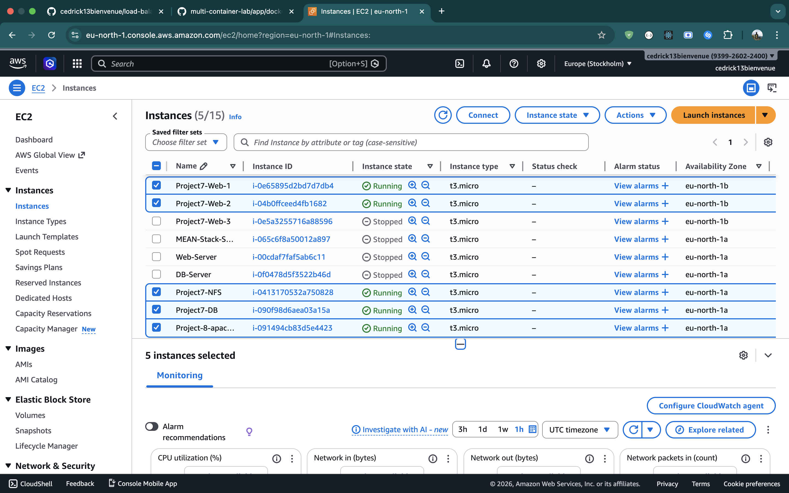

---

## Phase 1: Launch the Jenkins EC2 Instance

### 1.1 Create the EC2 Instance

**1.** Sign in to the **AWS Management Console** → navigate to **EC2** → click **Instances** → click **Launch instances**.

**2.** Under **Name and tags**:

| Field | Value |
|---|---|
| **Name** | `Project9-Jenkins` |

**3.** Under **Application and OS Images (Amazon Machine Image)**:

| Field | Value |
|---|---|
| **AMI** | Click **"Ubuntu"** from the quick-select tabs |
| **Version** | `Ubuntu Server 24.04 LTS (HVM), SSD Volume Type` |
| **Architecture** | `64-bit (x86)` |

**4.** Under **Instance type**:

| Field | Value |
|---|---|
| **Instance type** | `t2.micro` (Free tier eligible). Use `t3.micro` if unavailable. |

**5.** Under **Key pair (login)**:

| Field | Value |
|---|---|
| **Key pair name** | Select your existing `.pem` key pair |

**6.** Under **Network settings** → click **Edit**:

| Field | Value |
|---|---|
| **VPC** | Default VPC |
| **Subnet** | Leave as default |
| **Auto-assign public IP** | `Enable` |
| **Firewall** | Select **"Create security group"** |
| **Security group name** | `Project9-Jenkins-SG` |
| **Description** | `Security group for Jenkins CI server` |

**Inbound Rules:**

| Type | Protocol | Port | Source |
|---|---|---|---|
| `SSH` | `TCP` | `22` | `My IP` |
| `Custom TCP` | `TCP` | `8080` | `Anywhere-IPv4` (0.0.0.0/0) |

> **Note**: Port 8080 is the default port Jenkins listens on. It must be open so you can access the Jenkins UI from your browser and so GitHub webhooks can reach it.

**7.** Under **Configure storage**:

| Field | Value |
|---|---|
| **Root volume size** | `8 GiB` (default) |
| **Volume type** | `gp3` |

**8.** Click **Launch instance**. Click **View all instances** to return to the instances list. Wait until:
- **Instance State** = `Running`
- **Status checks** = `2/2 checks passed`

**9.** Click on the `Project9-Jenkins` instance row to select it. In the details panel at the bottom, note down the **Public IPv4 address** — you will use this throughout the project.

> **Expected Output**: EC2 console showing `Project9-Jenkins` in `Running` state with `2/2 checks passed` and the Public IPv4 address visible in the details panel.
> 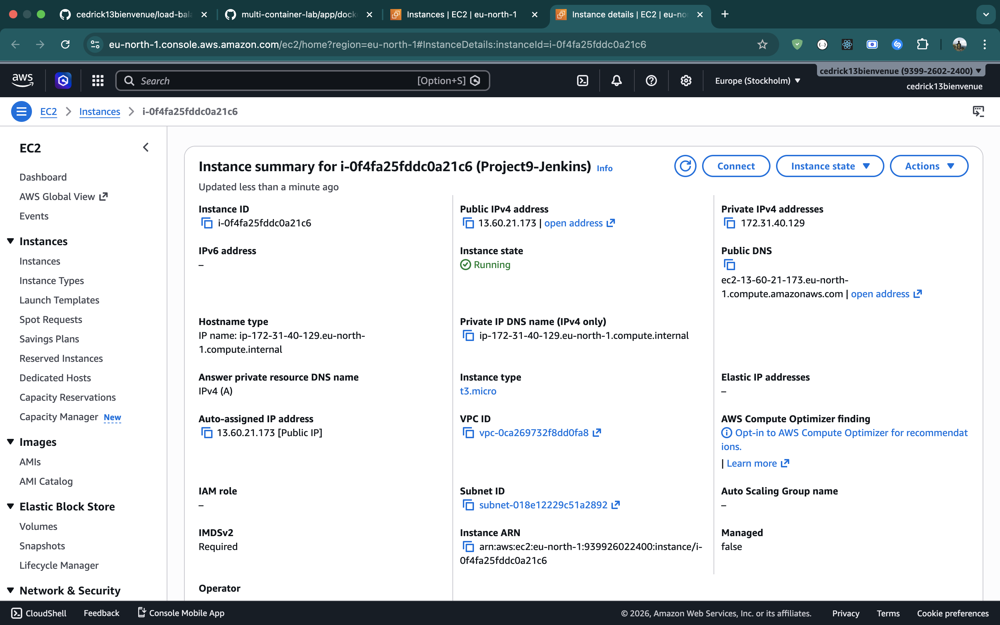

---

## Phase 2: Install Jenkins on the Server

### 2.1 SSH Into the Jenkins Server

**10.** Open your terminal and navigate to the folder containing your `.pem` key:

```bash
cd /path/to/your/key
```

**11.** Set the correct permissions on the key file (required by SSH):

```bash
chmod 400 cedriq-ec2.pem
```

**12.** Connect to the Jenkins server — replace `<JENKINS-PUBLIC-IP>` with your actual public IP:

```bash
ssh -i cedriq-ec2.pem ubuntu@<JENKINS-PUBLIC-IP>
```

When prompted `Are you sure you want to continue connecting (yes/no)?` type `yes` and press Enter.

> **Note**: Ubuntu EC2 instances use `ubuntu` as the default SSH user.

---

### 2.2 Update the Server

**13.** Always update the package list before installing anything:

```bash
sudo apt update && sudo apt upgrade -y
```

---

### 2.3 Install Java

Jenkins is a Java application and requires Java to run. Install OpenJDK 17:

**14.**
```bash
sudo apt install fontconfig openjdk-17-jre -y
```

**15.** Verify the installation:

```bash
java -version
```

Expected output:
```
openjdk version "17.0.x" 2024-xx-xx
OpenJDK Runtime Environment (build 17.0.x+x-Ubuntu-...)
OpenJDK 64-Bit Server VM (build 17.0.x+x-Ubuntu-..., mixed mode, sharing)
```

> **Expected Output**: Terminal showing `java -version` with OpenJDK 17 version details.
> 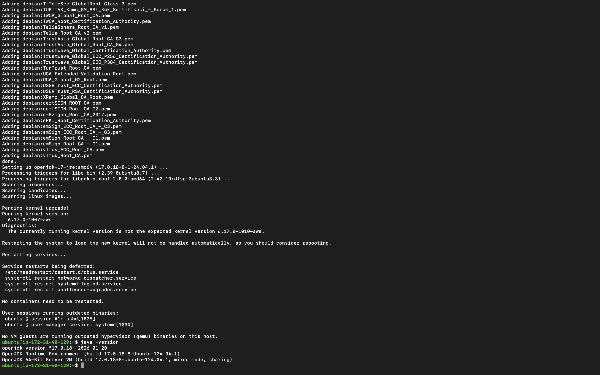

---

### 2.4 Install Jenkins

**16.** Add the Jenkins repository signing key so Ubuntu trusts the Jenkins packages:

```bash
sudo gpg --keyserver keyserver.ubuntu.com --recv-keys 7198F4B714ABFC68
sudo gpg --export 7198F4B714ABFC68 | sudo tee /usr/share/keyrings/jenkins-keyring.gpg > /dev/null
```

**17.** Add the Jenkins repository to apt sources:

```bash
echo "deb [signed-by=/usr/share/keyrings/jenkins-keyring.gpg] https://pkg.jenkins.io/debian-stable binary/" | sudo tee /etc/apt/sources.list.d/jenkins.list > /dev/null
```

**18.** Update apt to pick up the new Jenkins repository:

```bash
sudo apt update
```

**19.** Install Jenkins:

```bash
sudo apt install jenkins -y
```

---

### 2.5 Start and Enable Jenkins

**20.** Enable Jenkins to start automatically on every server reboot:

```bash
sudo systemctl enable jenkins
```

**21.** Start the Jenkins service:

```bash
sudo systemctl start jenkins
```

**22.** Verify Jenkins is running:

```bash
sudo systemctl status jenkins
```

Look for the line: `Active: active (running)` — it should appear in green. Press `q` to exit.

> **Expected Output**: Terminal showing `sudo systemctl status jenkins` with `Active: active (running)` in green.
> 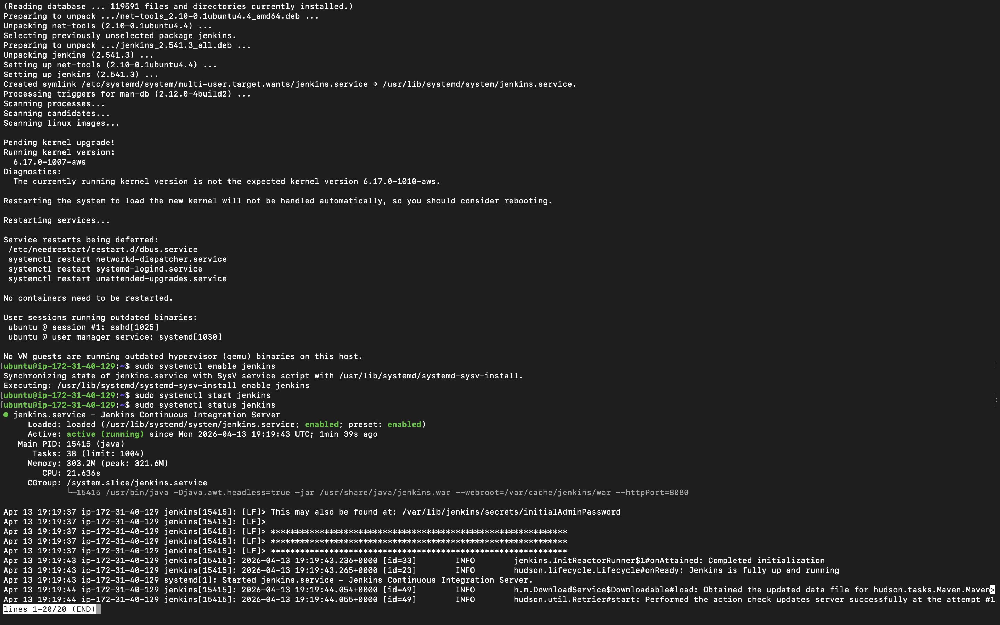

---

## Phase 3: Complete the Jenkins Initial Setup in the Browser

### 3.1 Open Jenkins in the Browser

**23.** Open a new tab in your browser and navigate to:

```
http://<JENKINS-PUBLIC-IP>:8080
```

> **Note**: Use the **Public IPv4 address** of your Jenkins instance — not the private IP (`172.31.x.x`). The private IP is only reachable within the AWS VPC and will time out in your browser.

You will see a page titled **"Unlock Jenkins"**.

> **Expected Output**: Browser showing the Jenkins "Unlock Jenkins" page with the Administrator password field.
> 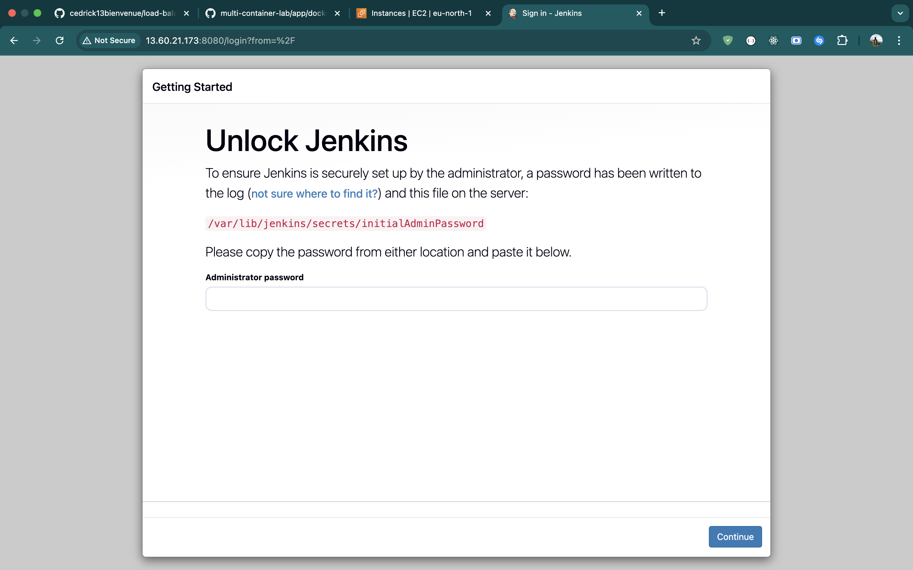

---

### 3.2 Retrieve the Initial Admin Password

**24.** Go back to your terminal (still connected to the Jenkins server) and run:

```bash
sudo cat /var/lib/jenkins/secrets/initialAdminPassword
```

**25.** Copy the long alphanumeric string that is printed (e.g. `a1b2c3d4e5f6a1b2c3d4e5f6a1b2c3d4`).

**26.** Paste it into the **Administrator password** field on the Unlock Jenkins page in your browser, then click **Continue**.

---

### 3.3 Install Suggested Plugins

**27.** On the "Customize Jenkins" page, click **"Install suggested plugins"** (the left option with the cloud icon).

Jenkins will download and install all standard plugins. This takes 3–7 minutes depending on network speed. Do not refresh the page.

> **Expected Output**: Jenkins plugin installation progress screen showing multiple plugins with loading bars.
> 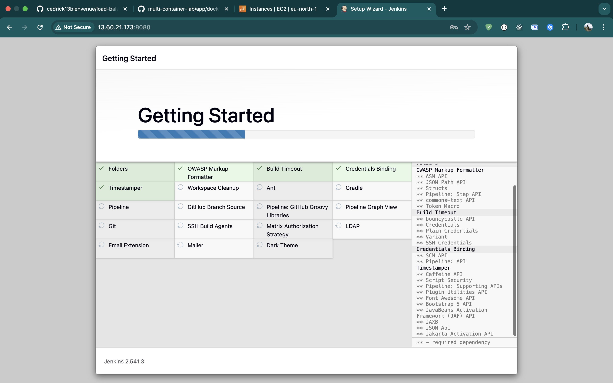

---

### 3.4 Create the First Admin User

**28.** After plugins finish installing, fill in the **"Create First Admin User"** form:

| Field | Value |
|---|---|
| **Username** | Choose a username (e.g. `admin`) |
| **Password** | Choose a strong password |
| **Confirm password** | Repeat the password |
| **Full name** | Your full name |
| **E-mail address** | Your email |

**29.** Click **"Save and Continue"**.

**30.** On the **"Instance Configuration"** page, leave the Jenkins URL as pre-filled (`http://<JENKINS-PUBLIC-IP>:8080/`) and click **"Save and Finish"**.

**31.** Click **"Start using Jenkins"**.

You are now on the Jenkins dashboard — the main home page with the left sidebar showing **New Item**, **People**, **Build History**, etc.

> **Expected Output**: Browser showing the Jenkins main dashboard after first login.
> 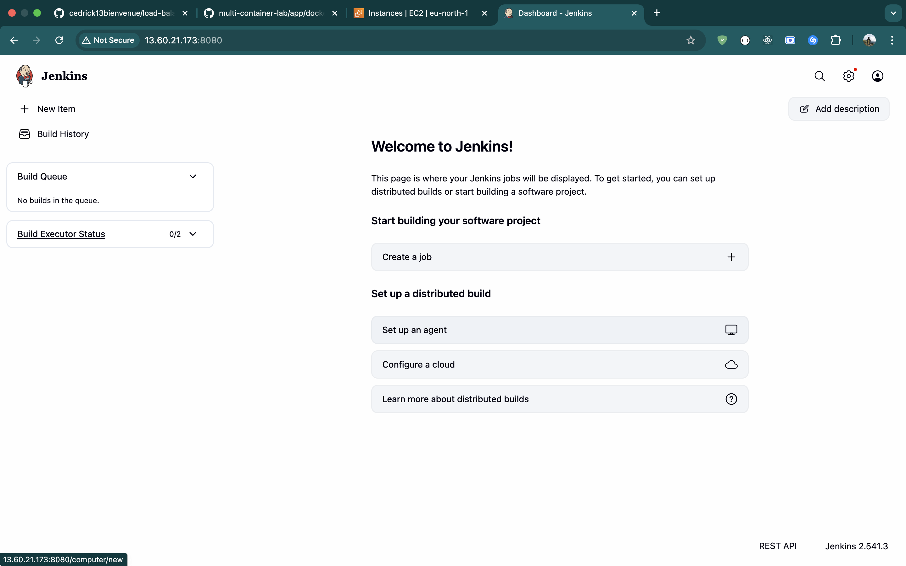

---

## Phase 4: Connect the GitHub Repository to Jenkins

### 4.1 Prepare the GitHub Repository

**32.** Fork the tooling repository from the Darey.io GitHub account:

```
https://github.com/darey-io/tooling
```

On the fork page, set the **Repository name** to `tooling-jenkins`, ensure your GitHub account is selected as the owner, then click **Create fork**.

**33.** After forking, rename the repository if needed by going to the repo **Settings** → change the name to `tooling-jenkins` → click **Rename**. Your repo will now be at:

```
https://github.com/cedrick13bienvenue/tooling-jenkins
```

---

### 4.2 Create a Jenkins Freestyle Job

**34.** On the Jenkins dashboard, click **"New Item"** in the left sidebar.

**35.** Fill in the New Item form:

| Field | Value |
|---|---|
| **Item name** | `tooling-website` |
| **Project type** | `Freestyle project` |

Click **OK**.

---

### 4.3 Configure Source Code Management

**36.** On the job configuration page, scroll to **"Source Code Management"** and select the **Git** radio button.

**37.** In the **Repository URL** field, enter:

```
https://github.com/cedrick13bienvenue/tooling-jenkins.git
```

> **Note**: Include the `.git` suffix. A red error warning will appear under the field — this is expected until credentials are added.

**38.** Next to the **Credentials** dropdown, click **"+ Add"** → **"Global"** → select **"Username with password"** from the credential type list → click **Next**.

**39.** Fill in the credentials form:

| Field | Value |
|---|---|
| **Kind** | `Username with password` |
| **Username** | `cedrick13bienvenue` |
| **Password** | Your GitHub Personal Access Token (`ghp_...`) |
| **Description** | `GitHub PAT` |

> **Note**: GitHub no longer accepts your account password for Git operations. You must use a **Personal Access Token (PAT)**. To create one: GitHub → Profile → Settings → Developer settings → Personal access tokens → Tokens (classic) → Generate new token (classic). Set the `repo` scope and copy the token immediately — GitHub will not show it again.

Click **Create**.

**40.** In the **Credentials** dropdown, select the credentials you just added. The red error warning under the Repository URL should disappear — confirming Jenkins can access the repo.

**41.** In the **"Branch Specifier"** field, change `*/master` to match your repo's default branch:

```
*/master
```

> **Note**: The `darey-io/tooling` repo uses `master` as its default branch. Verify the branch name by checking the branch dropdown on your GitHub repo page.

**42.** Scroll to **"Build Triggers"** and check **"GitHub hook trigger for GITScm polling"**.

**43.** Scroll to **"Build Steps"** → click **"Add build step"** → select **"Execute shell"**. Enter:

```bash
echo "Jenkins build triggered successfully"
ls -la $WORKSPACE
```

**44.** Click **Save**.

> **Expected Output**: Jenkins job configuration page showing the SCM section with the repository URL filled in, credentials selected with no red error, and the branch specifier set.
> 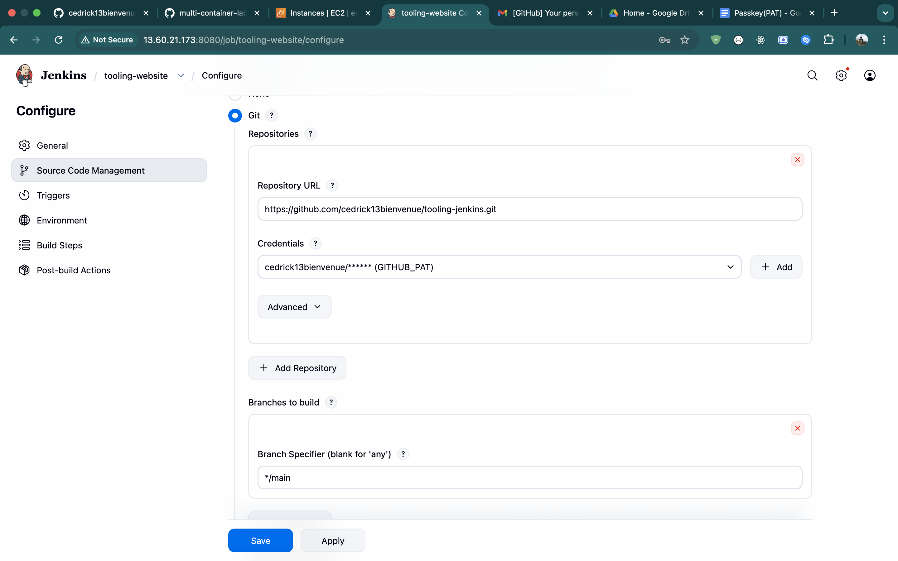

---

### 4.4 Run the First Manual Build

**45.** On the `tooling-website` job page, click **"Build Now"** in the left sidebar.

**46.** In the **Build History** panel at the bottom left, wait for **#1** to finish. A **blue circle** means success; a **red circle** means failure.

**47.** Click on **#1** → **"Console Output"** and verify:
- Jenkins cloned your `tooling-jenkins` repository
- The file listing from `ls -la $WORKSPACE` is visible
- The last line reads: `Finished: SUCCESS`

> **Expected Output**: Jenkins Console Output for Build #1 showing the cloned repository files and `Finished: SUCCESS` at the bottom.
> 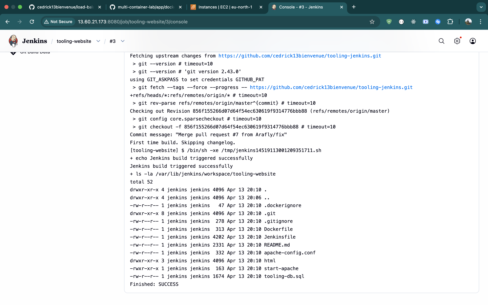

---

## Phase 5: Configure GitHub Webhook to Auto-Trigger Jenkins

### 5.1 Add the Webhook in GitHub

**48.** Go to your `tooling-jenkins` repository on GitHub:

```
https://github.com/cedrick13bienvenue/tooling-jenkins
```

**49.** Click the **Settings** tab → in the left sidebar click **"Webhooks"** → click **"Add webhook"**.

**50.** Fill in the webhook form:

| Field | Value |
|---|---|
| **Payload URL** | `http://<JENKINS-PUBLIC-IP>:8080/github-webhook/` |
| **Content type** | `application/json` |
| **Secret** | Leave blank |
| **Which events trigger this webhook?** | `Just the push event` |
| **Active** | Checked |

> **Note**: The trailing `/` at the end of the Payload URL is required. Replace `<JENKINS-PUBLIC-IP>` with the actual public IP of your `Project9-Jenkins` instance.

**51.** Click **"Add webhook"**.

**52.** GitHub automatically sends a `ping` event to Jenkins to verify the connection. Click on the webhook entry, scroll down to **"Recent Deliveries"**, and confirm the ping delivery shows a **green checkmark** with **Response code: 200**.

> **Expected Output**: GitHub webhook "Recent Deliveries" showing a ping event with a green checkmark and Response code: 200.
> 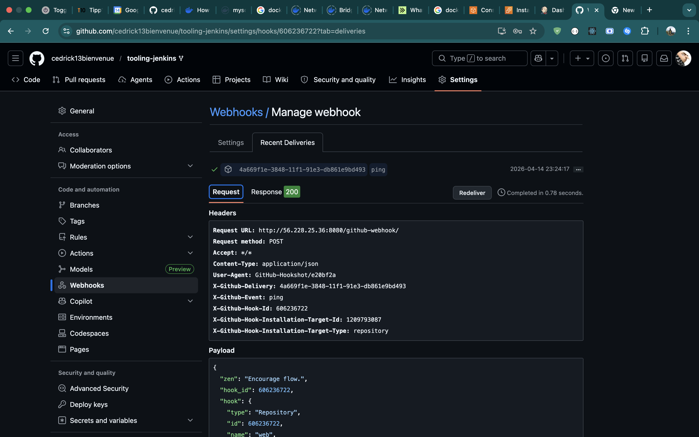

---

### 5.2 Test the Webhook with a Git Push

**53.** On your local machine, clone the `tooling-jenkins` repository:

```bash
git clone https://github.com/cedrick13bienvenue/tooling-jenkins.git
cd tooling-jenkins
```

**54.** Make a small change to trigger a build:

```bash
echo "# CI/CD pipeline test - Project 9" >> README.md
```

**55.** Stage, commit, and push:

```bash
git add README.md
git commit -m "test jenkins webhook trigger"
git push origin master
```

> **Note**: When prompted for a password during `git push`, use your GitHub Personal Access Token (`ghp_...`), not your GitHub account password.

**56.** Switch to your Jenkins browser tab. Within 5–10 seconds, **Build #2** should appear in the Build History — triggered **automatically** by the GitHub webhook, without clicking "Build Now".

> **Expected Output**: Jenkins job page showing a new build triggered automatically with a blue circle (success).
> 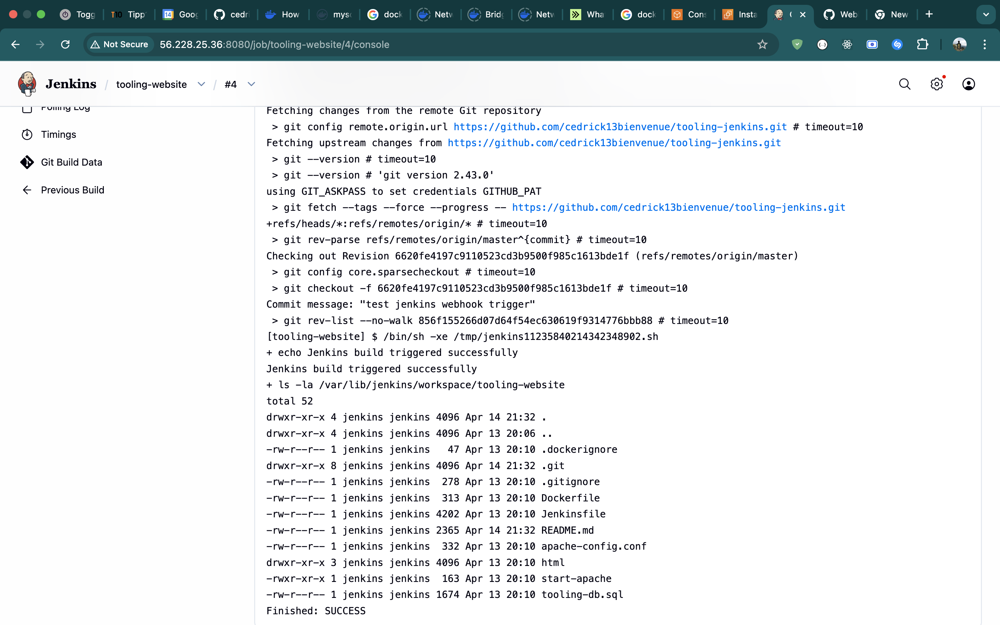

---

## Screenshots Reference

| # | File | Description |
|---|---|---|
| 1 | `screenshoots/all-instances-running.png` | AWS EC2 console — all existing instances Running with 2/2 checks passed |
| 2 | `screenshoots/jenkins-instance-running.png` | AWS EC2 console — Project9-Jenkins Running with 2/2 checks and Public IP visible |
| 3 | `screenshoots/java-version.png` | Terminal — `java -version` output showing OpenJDK 17 |
| 4 | `screenshoots/jenkins-status-active.png` | Terminal — `systemctl status jenkins` showing active (running) in green |
| 5 | `screenshoots/jenkins-unlock-page.png` | Browser — Jenkins Unlock Jenkins page |
| 6 | `screenshoots/jenkins-plugins-installing.png` | Browser — Jenkins plugin installation progress screen |
| 7 | `screenshoots/jenkins-dashboard.png` | Browser — Jenkins main dashboard after first login |
| 8 | `screenshoots/jenkins-job-scm-config.png` | Browser — Jenkins job SCM config with repo URL, credentials, and branch set |
| 9 | `screenshoots/jenkins-build1-success.png` | Browser — Jenkins Console Output Build #1 — Finished: SUCCESS |
| 10 | `screenshoots/github-webhook-ping-success.png` | GitHub — webhook Recent Deliveries showing ping with green checkmark and 200 response |
| 11 | `screenshoots/jenkins-build2-auto-triggered.png` | Browser — Jenkins job showing Build #2 auto-triggered with blue circle |
| 12 | `screenshoots/jenkins-build2-console-output.png` | Browser — Jenkins Console Output Build #2 — Finished: SUCCESS |
